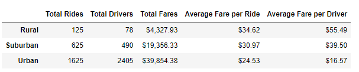

# PyBer_Analysis
## Overview of the PyBer Analysis
Ridesharing data for the months of January through April of 2019 was analyzed to determine how city type affects the the total fares received.  City types were categorized as either urban, suburban, or rural, and in addition to calculating the total fares each received, the totals were broken down further to understand the average fare amount and number of fares received.  Lastly, a multiple-line graph was created to view the total weekly fares for each city type. The graph clearly shows the differences by city type and how those differences can be used to make decision strategies involving ridesharing.  

## Results
### Comparing Totals and Averages between City Types
There are several differences in the data when comparing rideshare data between urban, suburban, or rural settings.  In the table below, the total rides, total drivers and total fares collected in urban regions is signficantly more than in suburban or rural settings.  Urban cities have 13 times more rides than rural cities and 2.6 times more rides than suburban cities.  The total fares in urban cities is nearly 9 times that of rural cities and 2 times that of suburban cities.  However, it is interesting to note that the average fare per ride is greater by $10 in rural settings versus urban, and greater than $3.50 when comparing rural to suburban.  Similarly, the average fare per driver is greatest in rural areas, followed next by suburban areas, with the least amount occuring in urban areas.  Hence, it is believed that while individuals in rural areas are less likely to rideshare, when they do the ride is longer and amounts to a larger fare.    

### Total Fares by Week across Four Months
The line graph below summarizes the total amount of fares by week according to city type from January through April of 2019.  While the total amount per week does vary slightly for each city type, the total fares received by urban areas are consistently greatly than suburban areas, which are consistently greater than rural areas.  The total fare collected in urban cities is about 8 times that of rural cities and about 2 times that of suburban cities.  The slight peaks and dips suggests there are times when rides are in more and less demand.  The peaks and dips do not appear to align by city type and may be caused by special events or activities in each area.  

## Summary
The needs and habits of individuals who participate in ridesharing are clearly different as illustrated in the data found in the results section.  Given these differences, three recommendations follow on how the overall rideshare revenue generated can be increased.  First, in rural areas more drivers should be employed to ensure a ride is available whenever an individual needs one.  It would also be helpful to advertise the availablity of the rideshare service and perhaps provide educational support to those individuals in rural areas who may not be aware of what ridesharing involves.  Second, in suburban areas 

 
